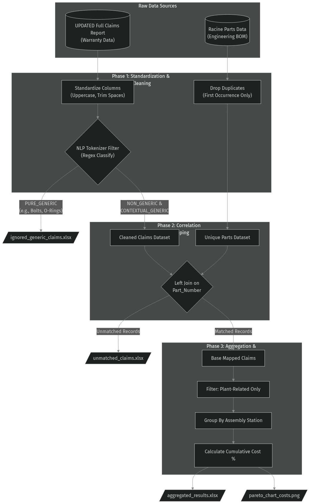

# Phase 2A: Plant Warranty to Assembly Station Correlation

The core objective of this project (Phase 2A) is to correlate **Plant-level Warranty Claims** to specific **Assembly Stations** using the **Part Number**. Ultimately, this generates Pareto Charts to visually identify the critical assembly stations responsible for the highest warranty costs and highest frequency of failures, providing data-driven support for subsequent process improvements. The following detailed explanation will outline exactly how this program is implemented step-by-step and describe the purpose of each file in the current folder.

---

## 📂 File Descriptions

In this `2a_plant_warranty` folder, you will find the following files:

### 📁 1. Required Input Files

To run this pipeline locally, place the following two proprietary datasets in the `original_records/` folder inside this directory:

- **`original_records/Racine Parts Data.xlsx`**: The engineering parts / Bill of Materials (BOM) containing mapping data linking Part Numbers to Assembly Stations.
- **`original_records/UPDATED Full Claims Report.xlsx`**: The master raw warranty claims dump spanning up to 2026.
- **`original_records/classified_claims_new.xlsx`**: An expert-curated manual classification set assigning formal warranty categories (Plant, Material, Design) to the visible claims subset.

### 💻 2. Scripts & Notebooks

- **`scripts/explore_2a.py`**: This is an initial exploratory script. Before writing the formal program, this was used to read the raw data, test which column names contained part information, and calculate how many identical part numbers existed between the two Excel files (approximately 400 overlapping parts were found).
- **`scripts/2a_analysis.py`**: **This is the single core automation program (Python script).** It performs all data loading, cleaning, merging, error validation, aggregation calculations, and Pareto charting. Additionally, it natively detects external manual category classifications (if provided) to automatically orchestrate robust category mapping and render production-ready Bar & Donut charts in one click.

### 📊 3. Correlation Results at a Glance

Based on the latest data pipeline (running the intelligent classification logic strictly on the visible dataset), below are the data mapping successes:

**Visible Verification Subset (Rows not hidden in raw file):**

- Total valid initial VISIBLE claims: 333
- Claims mapped dynamically to an Assembly Station: 239
- VISIBLE subset Mapping Rate: **71.77%**

###  4. Generated Outputs

The generated results are exported exclusively to the `visible_records/` folder, as the data pipeline now focuses specifically on processing the rows actively visible in the raw Excel dump:

#### 📂 `visible_records/`

- **`visible_cleaned_claims_report.xlsx`**: **Visible Cleaned Claims Data**. The original claims file contained nearly 900 hidden rows (likely from saved Excel filters). This file contains _strictly the exact visible rows_ that are natively visible when opening the raw Excel file, with spaces cleaned, allowing for 1:1 manual visual comparison.
- **`visible_full_mapped_claims.xlsx`**: **Visible Subset Mapped Claims**. This is a massive consolidated table that contains _all_ the original information from the claims report, joined together with _all_ the related information from the parts list for successfully matched records, strictly limited to the visible claims subset.
- **`visible_unmatched_claims.xlsx`**: **Visible Subset Unmatched Claims**. After running the merge program, there are some claims where the part number cannot be found in the "Parts List" to map to a station. These "orphan records" specifically from the visible rows failed to find a match and are exported separately for manual investigation.
- **`visible_ignored_generic_claims.xlsx`**: **Visible Subset Ignored Generic Parts**. Generic fastener claims specifically from the visible rows that were excluded from correlation to prevent artificial inflation of workstation costs.
- **`visible_aggregated_results.xlsx`**: **Visible Subset Aggregated Results**. An aggregation showing total warranty cost and occurrences exclusively calculated using the mapped combinations from the visible rows.
- **`visible_operator_breakdown.xlsx`**: **Visible Operator Statistics**. Operator granular breakdown logic applied strictly to the visible subsets, grouping costs by Assembly Station and Operator ID.
- **`visible_full_mapped_claims_with_categories.xlsx`**: **Enriched Categorized Claims Data**. The fully mapped claims dataset cleanly augmented with the manual category classification labels (Plant, Material, Design).
- **`visible_correlation_rate.png`**: **Correlation Success Rate Visualization**. A visual chart demonstrating the mapping success rate of the correlation script.
- **`visible_pareto_chart_costs.png`**: **Warranty Costs Pareto Chart**. A visual bar chart and cumulative percentage tracking overall dollars directly from the visible aggregated results table.
- **`visible_pareto_chart_costs_by_operator.png`**: **Operator Granular Cost Pareto Chart**. Operator granular rendering of the Pareto chart exclusively for visible records.
- **`visible_pareto_chart_occurrences.png`**: **Claim Occurrences Pareto Chart**. A visual bar chart tracking the raw frequency count (occurrences) of claims per station.
- **`category_distribution_chart.png`**: **Category Distribution Chart**. A high-quality visualization (bar and donut chart) displaying the absolute occurrences and proportional breakdown of the evaluated warranty failure categories.
- **`station_category_stacked_bar.png`**: **Station/Category Stacked Bar Chart**. Shows the top 15 highest warranty cost stations graphically divided by specific defect categories.
- **`station_category_heatmap.png`**: **Station/Category Heatmap**. A colored data grid visualizing where costs are concentrated across the intersection of assembly stations and defect categories.

### 🌟 Recommended Core Visualizations

For quick reference and inclusion in business review presentations, the following **5 charts** are considered the most valuable final outputs:
1. **`visible_pareto_chart_costs.png`** (Reveals the top stations driving the most overall warranty dollars)
2. **`visible_pareto_chart_occurrences.png`** (Reveals the top stations driving the highest pure frequency/volume of claims)
3. **`category_distribution_chart.png`** (Provides a global holistic breakdown of failure origins e.g. Plant vs Design)
4. **`station_category_heatmap.png`** (Cross-dimensional hotspot matrix linking individual stations to their exact defect categories)
5. **`visible_correlation_rate.png`** (Engineering validation proving raw data integrity and mapping success)

---

## 🚀 How to Run

Running this pipeline is completely automated. To execute the data engineering pipeline end-to-end:

1. Ensure your latest raw data files are placed in the `original_records/` directory:
   - `Racine Parts Data.xlsx`
   - `UPDATED Full Claims Report.xlsx`
   - *(Optional)* `classified_claims_new.xlsx` (If provided, the pipeline seamlessly integrates the manual categorization and builds the distribution charts).
2. Open your terminal and navigate to the `2a_plant_warranty/` directory.
3. Execute the core Python script:
   ```bash
   python3 scripts/2a_analysis.py
   ```
4. All generated output files and dynamic charts will immediately be refreshed and securely saved out to the `visible_records/` folder.

---

## ⚙️ How It Works: Step-by-Step

### 🏗️ Pipeline Architecture



When executed via the command line or an IDE, the `scripts/2a_analysis.py` program strictly adheres to the following sequence:

### Step 1: Data Loading & Cleaning

Raw Excel tables are often unstandardized and may contain spaces, mixed casing, or empty rows.

1. The program first reads both Excel files.
2. Next, it takes those messy column names (like `ActivityConsumption|ItemID` or `Unnamed: 4`) and **standardizes them** into easily understood names, such as `Part_Number`, `Warranty_Cost`, and `Assembly_Station_ID`.
3. The program automatically converts all part numbers to **UPPERCASE** and strips leading/trailing **whitespace**. This ensures that subsequent matching won't fail simply because of an extra space or different capitalization.
4. **Validation Check**: The program checks if there are any duplicate part numbers in `Racine Parts Data.xlsx`. If duplicates exist, the program automatically keeps the first record and drops the extras to prevent data "explosion" during merging (i.e., one row turning into multiple rows).

### Step 2: Data Correlation / Merging

This step is the core—joining the "Claims Data" and the "Station Data".

1. The program uses a method called a **Left Join**: It takes the "Claims Data" as the primary table and uses each "Part Number" within it to look up the corresponding "Assembly Station" in the "Parts List".
2. If it finds a match, it writes the name of the assembly station next to the claim record.
3. If it doesn't find a match, the assembly station field is left blank. The program extracts these unmatched records and saves them as `visible_unmatched_claims.xlsx`.
4. **Validation Check**: After merging, the program automatically verifies the data: If there were 1237 claim records before the merge, are there still exactly 1237 records after? If the total cost before the merge was $1M, is it still exactly $1M after? The program will only proceed if these numbers match perfectly, ensuring not a single cent is lost or duplicated.

### Step 3: Data Aggregation

Now that every claim record belongs to a station (except unmatched ones), totals are calculated.

1. The program filters out the data to keep only true, valid plant-related defect claims.
2. Then, the program performs a **Group By** based on the "Assembly Station", adding up all the occurrences of claims and the total costs under the same station.
3. Calculate Percentages: It calculates what percentage of the total cost each station accounts for, and calculates the **Cumulative Percentage** (e.g., if 1st place accounts for 40% and 2nd place accounts for 30%, the cumulative is 70%). This data is finally saved as `visible_aggregated_results.xlsx`.

### Step 4: Pareto Chart Visualization

A picture is worth a thousand words. Finally, the program calls a plotting tool:

1. It selects the top 15 stations with the highest warranty costs.
2. It draws out a sorted blue bar chart (representing the cost of each station).
3. It extracts deeper level correlations, plotting clustered groupings explicitly showing the Operator IDs inside of each station that actually performed the specific assembly actions, visually mapping these with a gradient to detect massive cost outliers.
4. It draws a red line graph (representing the cumulative percentage globally).
5. It saves these variations as image files (`visible_pareto_chart_costs.png` and `visible_pareto_chart_costs_by_operator.png`) ready for direct inclusion in process improvement reports.
